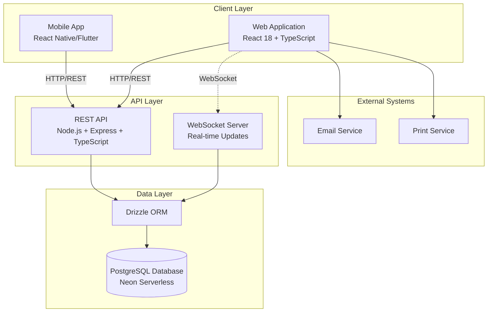

# Design Document

## Overview

The truck inspection system is designed as a three-tier architecture with a mobile-first approach for conducting inspections and a web interface for managing and distributing inspection results. The system uses a REST API as the central data controller, ensuring consistent data access across all platforms while leveraging an existing PostgreSQL database.

## Architecture

### System Architecture



### Component Architecture

The system consists of three main components:

1. **Mobile Application**: Primary inspection interface for field operations
2. **Web Application**: Management interface for viewing, printing, and distributing inspection data
3. **REST API**: Central data controller managing all database operations

## Components and Interfaces

### Mobile Application

**Purpose**: Conduct all truck inspections in the field
**Key Features**:
- Offline-capable inspection forms
- Photo capture and annotation
- Data synchronization with REST API
- Digital report generation

**Technology Stack** (To be determined):
- React Native or Flutter for cross-platform development
- Local storage for offline functionality
- Camera integration for photo capture
- Background sync capabilities

### Web Application

**Purpose**: View, print, and distribute inspection results
**Technology Stack**:
- **Framework**: React 18 with TypeScript for type safety
- **Build Tool**: Vite for fast development and optimized builds
- **UI Library**: ShadCN/ui component library built on Radix UI primitives
- **Styling**: Tailwind CSS with custom design tokens and CSS variables
- **Routing**: Wouter for lightweight client-side routing
- **State Management**: 
  - Zustand for client-side state management
  - TanStack Query for server state management and caching
- **Forms**: React Hook Form with Zod validation for type-safe form handling

**Key Components**:
- Dashboard for inspection overview
- Search and filter interface
- Inspection detail viewer
- Print report generator
- Email distribution system
- Export functionality

### REST API

**Purpose**: Central data controller for all system operations
**Key Responsibilities**:
- CRUD operations for inspection data
- Data validation and business logic
- Database connection management
- Error handling and logging
- Support for both mobile and web clients
- Real-time updates via WebSocket

**Technology Stack**:
- **Runtime**: Node.js with Express.js framework
- **Language**: TypeScript for full-stack type safety
- **Database**: PostgreSQL with Drizzle ORM
- **Database Provider**: Neon serverless PostgreSQL
- **Authentication**: JWT-based authentication with bcrypt password hashing (optional for future use)
- **Session Management**: PostgreSQL session store with connect-pg-simple
- **Real-Time Communication**: WebSocket server for live dashboard updates

**Note**: While authentication infrastructure is included in the backend stack for future extensibility, the initial implementation will operate as an internal system without login requirements.

## Data Models

### Core Entities

Based on the existing PostgreSQL database schema, the system will work with these primary entities:

#### Inspection (inspections table)
```typescript
interface Inspection {
  id: number;
  inspectiontype?: string;
  inspdate?: Date;
  inspsite?: string;
  inspector?: string;
  tractorno?: string;
  tcitruck?: boolean;
  trailerno?: string;
  tcitrailer?: boolean;
  moveno?: string;
  state?: string;
  licenseplate?: string;
  tractorstatus?: string;
  tractorinspection?: boolean;
  trailerinspection?: boolean;
  ctpatinspection?: boolean;
  drivervehicleinspection?: boolean;
  
  // Tractor inspection fields (ti_*)
  ti_requiredlamps?: string;
  ti_rdwinshieldwipers?: string;
  ti_frontwheelrimhubtire?: string;
  ti_fueltankarea?: string;
  ti_exhaustsystem?: string;
  ti_lowerupperfifthwheel?: string;
  
  // Tire inspection fields with depth, ID, and brand
  ti_lf_tiredepth?: string;
  ti_lf_tireid?: string;
  ti_lf_brand?: string;
  ti_lfo_tiredepth?: string;
  ti_lfo_tireid?: string;
  ti_lfo_brand?: string;
  // ... (many more tire fields)
  
  // Trailer inspection fields (tr_*, lst_*, rt_*)
  tr_status?: string;
  tr_trailerload?: string;
  tr_stacked?: boolean;
  lst_framebody?: string;
  lst_condhoses?: string;
  lst_slidingtandem?: string;
  lst_vanopenairbody?: string;
  lst_cargosecurement?: string;
  
  // CTPAT inspection fields (ctp_*)
  ctp_tractorbumper?: string;
  ctp_tractorengine?: string;
  ctp_tractortires?: string;
  ctp_tractorfloor?: string;
  ctp_tractorcab?: string;
  
  // Driver vehicle inspection fields (dv_*)
  dv_aircompressor?: string;
  dv_airlines?: string;
  dv_battery?: string;
  dv_body?: string;
  dv_brakeaccessories?: string;
  dv_brakeparking?: string;
  dv_brakeservice?: string;
  dv_clutch?: string;
  dv_engine?: string;
  dv_exhaust?: string;
  dv_lights?: string;
  dv_mirrors?: string;
  dv_steering?: string;
  dv_tires?: string;
  dv_transmission?: string;
  
  // Marker lights and signals
  markerlightsleftfront?: boolean;
  markerlightsleftcenter?: boolean;
  markerlightsleftrear?: boolean;
  markerlightsrear?: boolean;
  sideturnsignalsleft?: boolean;
  sideturnsignalsright?: boolean;
  rearlightsleftturn?: boolean;
  rearlightsrightturn?: boolean;
  
  // Additional fields
  ti_signature?: string;
  ti_initials?: string;
  drivername?: string;
  companyname?: string;
  note?: string;
  mexicancarrier?: string;
  mexicanbroker?: string;
  mexicancustomer?: string;
  pestcontamination?: string;
  recguid?: string;
}
```

#### InspectionImage (inspimage table)
```typescript
interface InspectionImage {
  id: number;
  inspectionid?: number;
  inspectionItem?: string;
  Inspectiontype?: string;
  datetimestamp?: Date;
  img_image?: string;
  imgbuffer?: Buffer;
  img_name?: string;
}
```

#### Driver (drivers table)
```typescript
interface Driver {
  id: number;
  lastname?: string;
  firstname?: string;
  drivertype?: string;
  tractorno?: string;
}
```

#### EmailSettings (emailsettings table)
```typescript
interface EmailSettings {
  id: number;
  lastname?: string;
  firstname?: string;
  reporttype?: string;
  emailaddr?: string;
}
```

#### MonthlyInspection (monthlyinspection table)
```typescript
interface MonthlyInspection {
  id: number;
  insplocation?: string;
  typeinspection?: string;
  inspector?: string;
  inspdate?: Date;
  fencebothsidesclear?: string;
  fencehasholes?: string;
  fenceblockedtreesvegetation?: string;
  trashcontainersavailable?: string;
  trashcontainersfull?: string;
  trashremovalproceduresevident?: string;
  trashcontainerleakholes?: string;
  trashcontainerneedreplaced?: string;
  trashcontainermoreneeded?: string;
  fencerepair?: string;
  trashcontainerhavelids?: string;
}
```

### API Endpoints

#### Inspection Management
- `GET /api/inspections` - List inspections with filtering and pagination
- `GET /api/inspections/:id` - Get specific inspection details
- `POST /api/inspections` - Create new inspection
- `PUT /api/inspections/:id` - Update inspection
- `DELETE /api/inspections/:id` - Delete inspection

#### Truck Management
- `GET /api/trucks` - List trucks
- `GET /api/trucks/:id` - Get truck details
- `GET /api/trucks/:id/inspections` - Get truck inspection history

#### Inspection Items
- `GET /api/inspections/:id/items` - Get inspection items
- `POST /api/inspections/:id/items` - Add inspection item
- `PUT /api/inspection-items/:id` - Update inspection item

#### Photo Management
- `POST /api/inspection-items/:id/photos` - Upload photo
- `GET /api/photos/:id` - Get photo
- `DELETE /api/photos/:id` - Delete photo

#### Reports and Export
- `GET /api/inspections/:id/report` - Generate inspection report
- `GET /api/inspections/export` - Export inspection data
- `POST /api/inspections/:id/email` - Email inspection report

## Error Handling

### API Error Responses
```typescript
interface ApiError {
  error: {
    code: string;
    message: string;
    details?: any;
    timestamp: Date;
  }
}
```

### Error Categories
- **400 Bad Request**: Invalid input data or malformed requests
- **404 Not Found**: Requested resource doesn't exist
- **409 Conflict**: Data conflicts (e.g., duplicate inspection numbers)
- **500 Internal Server Error**: Server-side errors
- **503 Service Unavailable**: Database connection issues

### Client-Side Error Handling
- **Mobile App**: Store failed requests for retry when connectivity returns
- **Web App**: Display user-friendly error messages with retry options
- **Both**: Log errors for debugging and monitoring

## Testing Strategy

### Unit Testing
- **API**: Test all endpoints, validation, and business logic
- **Web App**: Test React components, hooks, and utility functions
- **Mobile App**: Test core functionality and offline capabilities

### Integration Testing
- **API-Database**: Test all database operations and data integrity
- **Client-API**: Test API communication from both mobile and web clients
- **End-to-End**: Test complete inspection workflows

### Testing Tools
- **API**: Jest/Vitest with supertest for endpoint testing
- **Web App**: Vitest + React Testing Library + Playwright for E2E
- **Mobile App**: Platform-specific testing frameworks
- **Database**: Test database migrations and data consistency

### Test Data Management
- Use test database with sample inspection data
- Mock external services (email, file storage)
- Automated test data cleanup and reset

## Performance Considerations

### Database Optimization
- Index frequently queried fields (truck_id, inspection_date, status)
- Implement pagination for large result sets
- Use database connection pooling
- Consider read replicas for reporting queries

### API Performance
- Implement response caching for static data
- Use compression for large responses
- Implement rate limiting to prevent abuse
- Monitor API response times and database query performance

### Client Performance
- **Web App**: Code splitting and lazy loading for large components
- **Mobile App**: Efficient image compression and caching
- **Both**: Implement optimistic updates for better user experience

## Security Considerations

### Data Protection
- Input validation and sanitization on all API endpoints
- SQL injection prevention through parameterized queries
- File upload validation and virus scanning for photos
- Data encryption in transit (HTTPS)

### Internal System Security
- Network-level security (VPN, firewall rules)
- Regular security updates and patches
- Database access controls and monitoring
- Audit logging for all data modifications

### Mobile Security
- Secure local storage for offline data
- Certificate pinning for API communications
- App-level security measures (obfuscation, tamper detection)

## Deployment Architecture

### Development Environment
- Local development with Docker containers
- Shared development database for testing
- Hot reload for both web and API development

### Production Environment
- Load balancer for API high availability
- Database backup and recovery procedures
- Monitoring and alerting for system health
- Automated deployment pipelines

### Mobile App Distribution
- Internal app distribution (TestFlight, Firebase App Distribution)
- Device management and app updates
- Offline capability testing in various network conditions